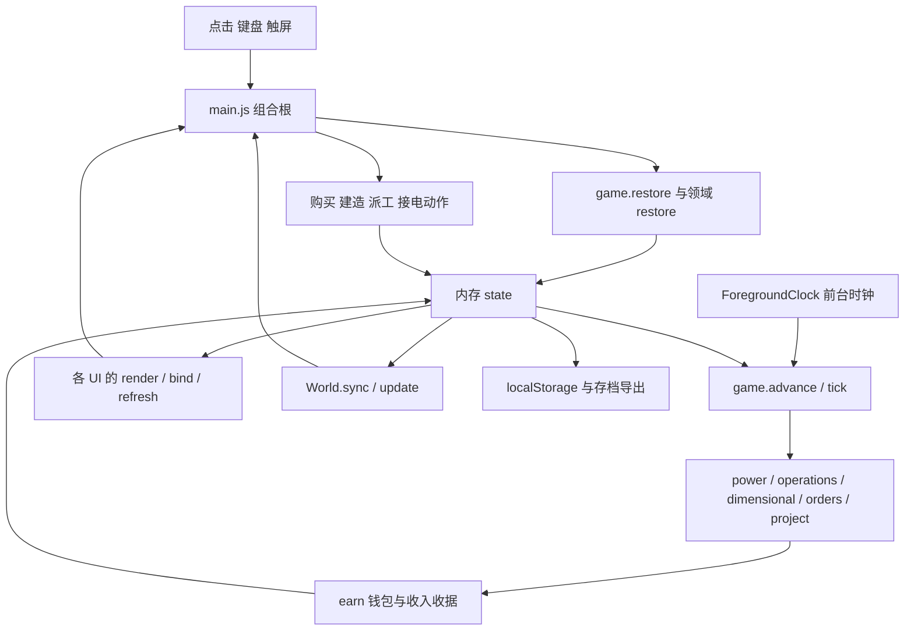

# 架构总览

这是原生 JavaScript + Three.js 游戏，使用 Vite 构建；不是个人主站的 Vue 应用。网页与小红书各有一套工作目录，共享玩法，通过逐文件核查维护同步；目前没有抽出一个共享 npm 包。

## 目录与权威性

| 范围 | 性质 | 可以怎样维护 |
|---|---|---|
| 游戏 `index.html`、`src/`、`public/`、依赖及 Vite 配置 | 正式运行代码与资源 | 这里的调用和真实模拟优先于历史策划 |
| `tests/` | Node 规则、兼容和部分结构回归 | 111 个 JS 文件中有 110 个顶层测试套件及一个 helper；不是 111 个独立测试用例 |
| `scripts/` | 生成、数值模拟、浏览器验证、运维 | 先读脚本参数和默认输出路径，历史脚本常绑定旧端口/版本；不全都适用于当前发布 |
| `docs/CHANGELOG.md`、`DEPLOYMENT.md`、双版状态表 | 发行记录 | 分清候选、Git 远端、实际服务器与平台审核 |
| `docs/v*/qa/` | 证据与历史样本 | 不覆盖固定历史存档，不把截图当源代码 |
| `docs/research/`、`spikes/`、`services/`、MC3 | 研究/另一个产品方向 | 不能把黄金、珍珠等候选经济系统当成 2.0 已实现规则 |
| `dist/`、XHS 的 `artifacts/` | 生成产物 | 修源码后重建，不手改压缩 JS |

## 一份 state，若干规则模块，两个表现层

`state` 是持久游戏事实。购买与领域动作负责修改它；UI 的局部选择、滚动、相机与待选址事务并不都属于存档。不要为了让某段 UI 记忆而把整个 DOM/World 对象序列化。

`main.js` 是组合根，创建领域 UI，把 callbacks 接到真实动作，并负责保存、通知、相机、前台和返回上下文。规则模块通常接收 `s`，同步计算或修改状态；UI 模块通常暴露 `create*UI(api)`，按 `render/bind/refresh` 展示与调用。代码并非完全无环或严格分层，必须检查实际导入者，不能假定所有 UI 都是纯函数。

## 用责任划分组件

| 子系统 | 权威入口 | 展示/接入 | 不应混淆 |
|---|---|---|---|
| 钱包、购买、模拟 | `game.js`、`catalog.js`、`economy.js` | `main.js`、`purchase-feedback.js`、`income.js` | 理论产能与实际成交分开 |
| 本体与改造 | `counts` / `upgrades.js` | `upgrades-ui.js`、`shopping-options.js` | 两套等级与各自价格/门槛 |
| 居民与岗位 | `residents.js`、`operations.js` | `workplace-board-ui.js`、`management-ui.js` | 基础收入、岗位贡献、搬运分别计算 |
| 电力和物流 | `power.js`、`routing.js`、`transport.js`、`dimensional.js` | `network-ui.js`、线路模型 | 画线/矿车动画不负责发钱 |
| 建造、土地、住房、园艺 | `layout.js`、`land*.js`、`housing.js`、`garden.js` | placement 事务、`World`、领域 UI | 绿色预览不能替代最终合法性检查 |
| 室内与直播 | `studio-placement.js`、`studio-purchases.js`、`game.js` | `studio-ui.js`、室内模型 | 室内尺寸与生产状态不是一套变量 |
| 提示与声音 | `narrative.js`、`notifications.js`、`game-audio.js` | `narrator-ui.js`、`records-ui.js` | 台词内容、可触发性、队列呈现、音频解锁分开 |
| 装扮与环境 | `collection.js`、`presentation.js`、`environment.js` | `collection-ui.js`、`observatory-ui.js` | 网页主题不改变世界生产/天气 |
| 邮箱 | `mail.js`、`mail-content.js` | `mail-ui.js` | 邮政持续收入与奖励信一次领取分开 |
| 存档与分享 | `game.restore`、`save-*` | `save-ui.js`、`share-ui.js` | 存档图恢复状态，纪念卡用于分享 |

## 三个重要时序

**买一件东西**：UI 状态解释 → 当前规则预检 → 可选确认/选址 → 领域提交再次检查 → 成功后保存、更新世界和反馈。取消不能提前扣款；连续操作不能重复提交。

**挣到一笔钱**：前台 tick → 真实生产/任务/成交 → `earn()` → 钱包与收入记录 → UI 增量更新。移动几辆矿车、播放一个音效都不应直接改变余额。

**打开旧档**：读取原数据 → 版本/格式检查及领域恢复 → 在草稿验证 → 备份当前世界 → 一次替换 → 重建 UI/场景 → 再次保存。坏数据或取消不能清空当前档。

## 维护债务，不等于已经发现的玩家 bug

- `main.js` 与 `world.js` 仍承载多个职责，小修应依照函数边界，不在本轮顺便拆大文件。
- CSS 存在多层历史覆盖；在末尾不断追加规则会增加回归范围。
- 部分验证脚本硬编码了旧版本、端口或 selector。本轮修正了稳定性脚本工业入口的 `industry` → `network`，并记录实际打开过的菜单，避免静默漏测。
- 研究和截图很多。不能因为文件存在就认为已交付，也不能凭“没有直接测试引用”判定代码无用。
- 索引通过 AST 跟踪静态导入、字面量动态导入和资源 URL；CSS 层叠、事件派发、回调、运行时字符串路径仍需人工追踪。
